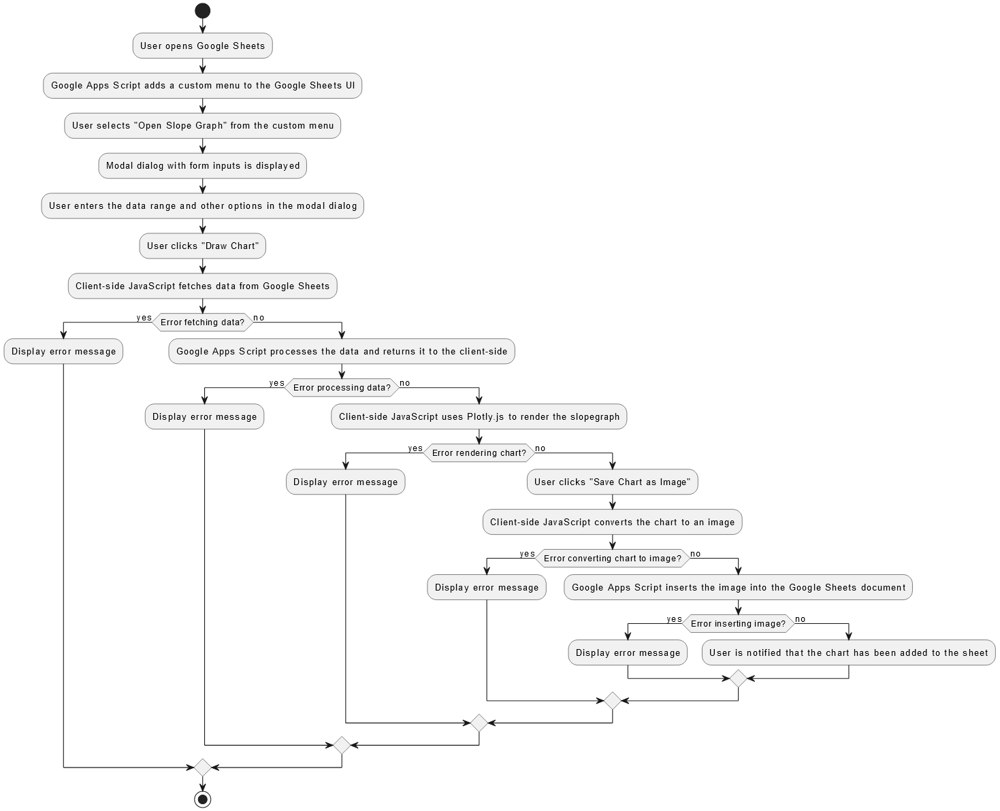

# Slopegraph in Google Sheets

## Overview

This project demonstrates how to create a custom slopegraph in Google Sheets using Google Apps Script (GAS) and Plotly.js. The slopegraph visualizes changes between two points in time for multiple categories, offering clear and direct labels on the graph itself.

## Why This Project?

Inspired by *Storytelling with Data* by Cole Nussbaumer Knaflic, I wanted to leverage the simplicity and effectiveness of slopegraphs to visualize changes over time. While Google Sheets doesn’t natively support slopegraphs, I aimed to develop a custom solution that integrates advanced visualizations directly into the tools used by non-technical stakeholders.

## Tools Used

- **Google Apps Script**: Automates tasks and extends the functionality of Google Sheets.
- **Plotly.js**: Creates interactive and customizable visualizations.

## Project Structure

The project involves four main files:

1. [**SlopeGraphMain.gs**](slopegraph-project/SlopeGraphMain.gs): The Google Apps Script file that creates a custom menu in Google Sheets and handles data fetching and image saving.
2. [**index.html**](slopegraph-project/index.html): The HTML file that defines the structure of the modal dialog displayed in Google Sheets.
3. [**styles.html**](slopegraph-project/styles.html): The CSS file that styles the modal dialog and its contents.
4. [**scripts.html**](slopegraph-project/scripts.html): The JavaScript file that includes Plotly.js and contains the logic for drawing the slopegraph and handling user interactions.


## Features

- **Interactive Slopegraph**: Utilizes Plotly.js to create interactive visualizations.
- **Custom Annotations and Colors**: Users can select custom colors for each category and add annotations for clear labeling.
- **Data Formatting**: Supports displaying values as percentages, formatted before rendering.
- **Seamless Integration**: Embeds visualizations directly in Google Sheets for enhanced accessibility and collaboration.

### Activity Diagram
To better illustrate the workflow of this project, I have created an activity diagram. This diagram outlines the steps taken to create and render the slopegraph, as well as the error handling mechanisms in place that helped me bring all the pieces together. 


## How to Use

### Setup

1. **Clone the Repository**:
    ```sh
    git clone https://github.com/RB-DataAnalyst/slopegraph-plotly-gas.git
    cd slopegraph-plotly-gas
    ```

2. **Open Google Sheets**:
    - Create a new Google Sheets document.

3. **Google Apps Script**:
    - Open the Script Editor (`Extensions` -> `Apps Script`).
    - Copy and paste the content from `SlopeGraphMenu.gs` into the script editor.
    - Save the project.

4. **HTML and CSS Files**:
    - In the Script Editor, create new HTML files (`index.html`, `styles.html`, `scripts.html`).
    - Copy and paste the content from the respective files in the repository into these HTML files.

### Usage

1. **Open the Slopegraph Modal**:
    - In your Google Sheets, you should see a new menu item called `Custom Menu`.
    - Click `Custom Menu` -> `Open Slope Graph`.

2. **Enter Data and Options**:
    - Enter the range of your data, title, and other options in the modal dialog.
    - Click `Draw Chart` to visualize the slopegraph.
    - Optionally, save the chart as an image directly into your Google Sheets.
